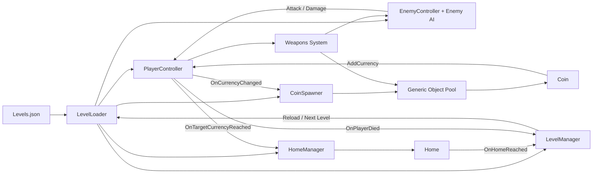

# Zombie Survival Game Architecture

## Technology Stack (Short)
- Engine: Unity `2022.3.62f3` (2D).
- Language: C# with `MonoBehaviour` gameplay components.
- Rendering: Universal Render Pipeline 2D (`Renderer2D`, URP assets in `Assets/Settings`).
- UI/Input: Unity `uGUI` (`UnityEngine.UI.Text`) and Unity Input axes (`WASD`, `Fire1`).
- Data: JSON-driven level configuration from `Assets/Resources/Levels/Levels.json`.

## Code Design Principles (Short)
- Component-based architecture: each gameplay domain is isolated into focused scripts.
- Interface-based extension: behavior contracts such as `IPlayerController` and `ILevelDataProvider` decouple implementation details.
- Event-driven game flow: progression and state changes are coordinated through domain events.
- Data-driven balancing: level, player, enemy, and spawn parameters are configured via JSON data.

## System Overview

## Core Components and Responsibilities

### Core Entities

#### Player (`PlayerController`)
- Responsibility: Handles movement, facing, health, currency tracking, and gameplay events.
- Key dependencies: `Rigidbody2D`, `Animator`, `UnityEngine.UI.Text`, `IPlayerController`.

#### Enemy (`EnemyController` + Enemy AI Behavior)
- Responsibility: Controls zombie patrol/chase/attack behavior and applies combat pressure on the player.
- Key dependencies: `Rigidbody2D`, `Animator`, `PlayerController`, patrol route data.

#### Coin (`Coin`)
- Responsibility: Awards currency to the player when collected and returns to the spawn lifecycle.
- Key dependencies: trigger collider, `PlayerController`, `CoinSpawner`/pool integration.

#### Home (`Home`)
- Responsibility: Acts as the level exit trigger when the player reaches it.
- Key dependencies: trigger collider, `LevelManager` subscription.

#### Weapons (`Weapons System`)
- Responsibility: Manages active weapon behavior, shooting logic, and zombie damage application.
- Key dependencies: player input/facing, enemy damage interface, pooled projectiles.

#### Level Data (`Levels.json`)
- Responsibility: Stores level identity, coin goals, player config, zombie config, and patrol paths.
- Key dependencies: consumed by the level loading pipeline.

### Logic Units

#### Level Loading (`LevelLoader` + `ILevelDataProvider`)
- Responsibility: Coordinates level initialization, applies per-level gameplay settings, and orchestrates runtime setup.
- Key dependencies: `PlayerController`, enemy prefab/controller, `CoinSpawner`, `HomeManager`, `LevelManager`, callback-based data loading (`onSuccess`, `onError`).

#### Input Control (`HumanController` / `IPlayerController`)
- Responsibility: Captures player input and translates it into player movement commands.
- Key dependencies: keyboard input, `PlayerController.SetMoveDirection`.

#### Coin Spawn Lifecycle (`CoinSpawner`)
- Responsibility: Maintains the target amount of collectible coins on the map and controls spawn positions.
- Key dependencies: `Tilemap` bounds, `PlayerController` currency events, object pool.

#### Home Objective Logic (`HomeManager`)
- Responsibility: Activates and positions the home objective once goal currency is reached.
- Key dependencies: `PlayerController.OnTargetCurrencyReached`, `Home`, `Tilemap` bounds.

#### Level Flow Management (`LevelManager`)
- Responsibility: Owns level completion/death messaging and transition control (restart/next level).
- Key dependencies: `Home`, `PlayerController`, `LevelLoader`, `CoinSpawner`, UI panel/text.

#### Runtime Reuse (`Generic Object Pool`)
- Responsibility: Reuses runtime objects to keep spawning and combat allocation-free.
- Key dependencies: `CoinSpawner`, coin instances, projectiles, other reusable prefabs.

## Event and Dependency Flow
1. `LevelLoader` loads level data and applies player, enemy, and spawn configuration.
2. `CoinSpawner` manages active collectibles and listens to player currency progress.
3. `Coin` collection raises player currency and progress events.
4. Reaching the goal currency activates `Home` through `HomeManager`.
5. Reaching `Home` triggers `LevelManager` to complete the level and advance progression.
6. Combat systems run continuously: enemy attacks reduce player health, weapons reduce enemy threat.
7. `LevelManager` handles death recovery and level re-entry through the loader.

## game core loop
1. Player enters a level with data-defined stats and objectives.
2. Player moves, avoids zombie pressure, and collects coins.
3. Enemy AI patrols, chases, and attacks based on player proximity and conditions.
4. Player uses weapons to control zombie threats while progressing toward the coin goal.
5. Coin goal completion reveals the home objective.
6. Player reaches home to complete the level and continue progression.
7. If player health reaches zero, the level is restarted through the level management flow.
